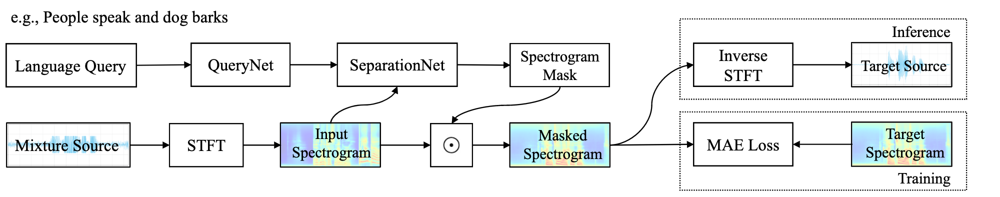

# Language-Queried Audio Source Separation

This repository contains the code and models of "[Separate What You Describe: Language-Queried Audio Source Separation](https://arxiv.org/pdf/2203.15147.pdf)" [INTERSPEECH 2022].

<p align="center">
  
</p>

Check the examples and presentation video in the [Demo Page](https://liuxubo717.github.io/LASS-demopage/)!

### Setup 
Clone the repository and setup the conda environment: 

  ```
  git clone https://github.com/liuxubo717/LASS.git && \
  cd LASS && \ 
  conda env create -f environment.yml && \
  conda activate LASS 
  ```

### Inference 
For running the inference of the pre-trained LASS-Net model, please download our pre-trained [checkpoint](https://drive.google.com/file/d/1f8eCCYYaBdhsFqoi7PJMrT9Oo7GaWLdR/view?usp=sharing) and put it under `ckpt/`. We prepare ten audio mixtures (in  `examples/`) with text queries (as illustrated in the [Demo Page](https://liuxubo717.github.io/LASS-demopage/)) for a toy inference running. 

Run inference with AudioCaps text queries:

  ```
  python inference.py -q AudioCaps
  ```
Or run inference with our collected human annotations:
  ```
  python inference.py -q Human
  ```
The separated audio clips will be automatically saved in `output/`.

### Dataset Recipe
Due to the copyright of AudioSet we cannot release the raw data. The training and evaluation indexes in this work are available at  `dataset/`. For faciliating the reproduction and comparsion, we release our code of creating audio mixtures at `utils/create_mixtures.py`. Here is an example of usage:
  ```python
  from utils.create_mixtures import add_noise_and_scale
  wav1 = torch.randn(1, 32000)
  wav2 = torch.randn(1, 32000)
  target, noise, snr, scale = add_noise_and_scale(wav1, wav2)
  ```
### Updates
- [x] Provide conda-pack envs
- [x] Inference code and model release
- [x] Dataset release
- [x] Training code release at [AudioSep repo](https://github.com/Audio-AGI/AudioSep)


### Citation
```
@inproceedings{liu2022separate,
  title={Separate What You Describe: Language-Queried Audio Source Separation},
  author={Liu, Xubo and Liu, Haohe and Kong, Qiuqiang and Mei, Xinhao and Zhao, Jinzheng and Huang, Qiushi and Plumbley, Mark D and Wang, Wenwu},
  booktitle = {INTERSPEEH},
  year = {2022}
}
```
